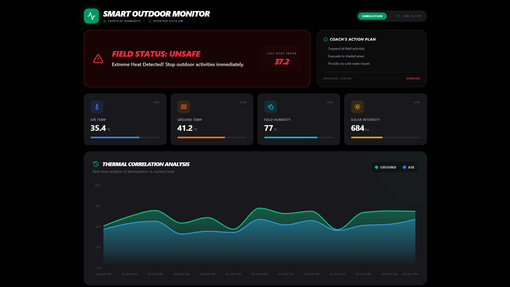
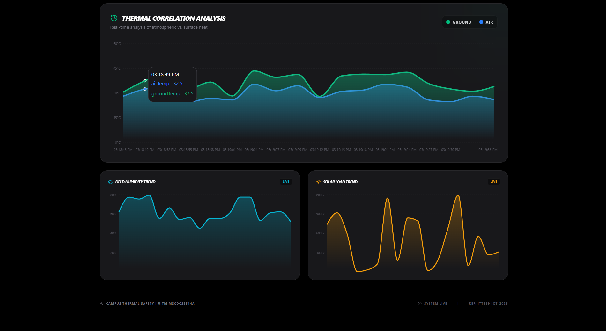

# Smart Outdoor Sports Monitor

## Overview

Smart Outdoor Sports Monitor is an full-stack Internet of Things (IoT) system designed to monitor environmental safety conditions in outdoor sports environments. The system continuously measures air temperature, ground surface temperature, humidity, and sunlight intensity, then evaluates whether conditions are safe for physical activity.

Sensor data is transmitted in real time using MQTT through an EMQX broker hosted on a VPS, processed by a Node.js backend server deployed on Fly.io, and logged to ThingSpeak for cloud analytics and historical monitoring. The system provides both local alerts through onboard hardware and remote visualization through a web dashboard.

This project was successfully demonstrated during a public exhibition, showcasing stable real-time operation, cloud integration, and intelligent safety evaluation.

---

## Live Demo

Web Dashboard (Vercel deployment):

[https://smart-sports-monitor.cxdzy.workers.dev/](https://smart-sports-monitor.cxdzy.workers.dev//)

Live backend API endpoint (Fly.io):

[https://mqtt-server-js-porh-a.fly.dev/data](https://mqtt-server-js-porh-a.fly.dev/data)

The dashboard displays real-time environmental sensor data and safety status generated by the Smart Outdoor Sports Monitor.

## Dashboard Preview




---

## Objectives

* Monitor environmental conditions of outdoor sports fields in real time
* Detect unsafe thermal conditions using automated threshold logic
* Provide immediate safety alerts to users
* Log environmental data to the cloud for validation and analysis
* Demonstrate a practical Smart Campus IoT safety solution

---

## System Architecture

The system architecture is organized into three primary layers: hardware sensing, communication and backend processing, and cloud analytics.

### 1. Hardware Layer (ESP32 Device)

The sensing unit is built around an ESP32 microcontroller and includes:

* DHT11 temperature and humidity sensor
* DS18B20 waterproof ground temperature sensor
* GL55 LDR sunlight sensor
* 20x4 I2C LCD display
* Buzzer for unsafe condition alerts

The ESP32 collects sensor readings, evaluates safety conditions locally, and publishes structured JSON messages via MQTT.

### 2. Communication and Backend Layer

An EMQX MQTT broker hosted on a VPS manages real-time message transmission between the ESP32 and backend services.

Node.js backend server:

[https://github.com/cxdzy/mqtt-server-js](https://github.com/cxdzy/mqtt-server-js)

The backend server is deployed on Fly.io and is responsible for:

* Subscribing to MQTT sensor topics
* Parsing incoming JSON sensor payloads
* Storing the latest sensor state
* Forwarding data to ThingSpeak
* Providing REST API endpoints for the web dashboard

### 3. Cloud Analytics Layer

ThingSpeak is used as the cloud analytics platform for:

* Long-term data logging
* Historical visualization
* Environmental trend analysis
* Independent system validation

---

## Features

* Real-time environmental monitoring
* Automated safety evaluation logic
* MQTT-based communication via EMQX
* Cloud data logging with ThingSpeak
* Historical sensor visualization
* Local LCD safety status display
* Audible alert for unsafe conditions
* Web dashboard integration
* Cloud-deployed backend API

---

## Safety Logic

The system marks environmental conditions as unsafe when any threshold is exceeded:

* Ground temperature greater than 55°C
* Air temperature greater than 35°C
* Sunlight intensity greater than 850

If any threshold is exceeded, the system sets the status to **UNSAFE**, activates alerts, and updates the dashboard accordingly. Otherwise, the status remains **SAFE**.

---

## Installation and Setup

### Cloudflare Environment (Wrangler)

For local Cloudflare development with Wrangler:

```bash
cp .dev.vars.example .dev.vars
```

Then set your key in `.dev.vars`:

```dotenv
WEATHER_API_KEY=your_weatherapi_key_here
```

For Cloudflare production, add `WEATHER_API_KEY` as a Secret in your Worker/Pages project settings. The dashboard uses a server-side `/api/weather` proxy, so the key is not exposed in the frontend bundle.

### Hardware Setup

1. Connect all sensors and peripherals to the ESP32 according to the circuit design
2. Upload the ESP32 firmware using the Arduino IDE
3. Configure WiFi credentials in the source code

### Backend Server

```
git clone https://github.com/cxdzy/mqtt-server-js
cd mqtt-server-js
npm install
npm start
```

### ThingSpeak Configuration

1. Create a ThingSpeak channel
2. Generate API keys
3. Configure environment variables in the backend server
4. Map sensor fields correctly

---

## Demonstration Results

During exhibition testing:

* Continuous real-time MQTT data transmission was achieved
* The Fly.io backend server operated reliably
* ThingSpeak successfully logged long-term environmental data
* Safety logic responded accurately to changing conditions
* The system maintained stable performance during live demonstrations

---

## Technologies Used

* ESP32 microcontroller
* Arduino framework
* Node.js and Express.js
* MQTT protocol with EMQX broker
* Fly.io cloud deployment
* ThingSpeak IoT platform
* JavaScript
* Embedded C/C++

---

## Future Improvements

* Mobile application integration
* Advanced predictive heat analysis
* Automated notification system
* Expanded sensor network coverage
* Machine learning-based safety prediction

---

## Author

Developed by Me

---

## License

This project is intended for academic and educational use.
